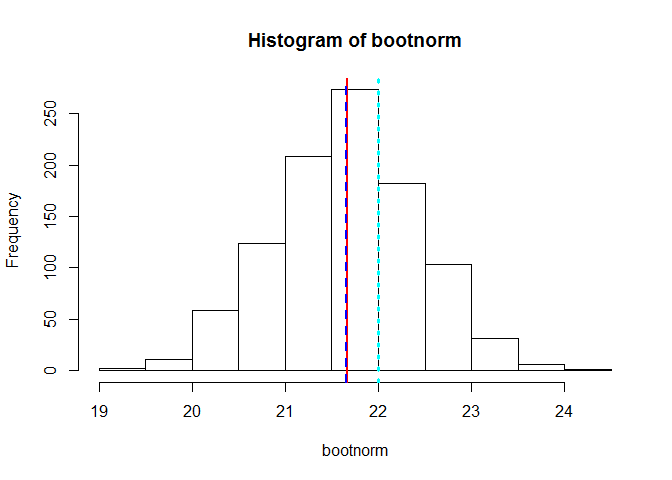
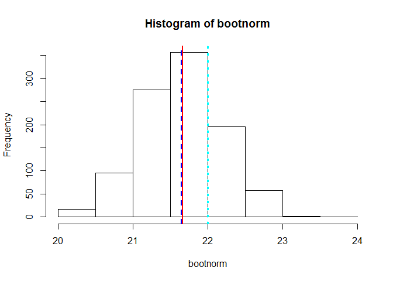
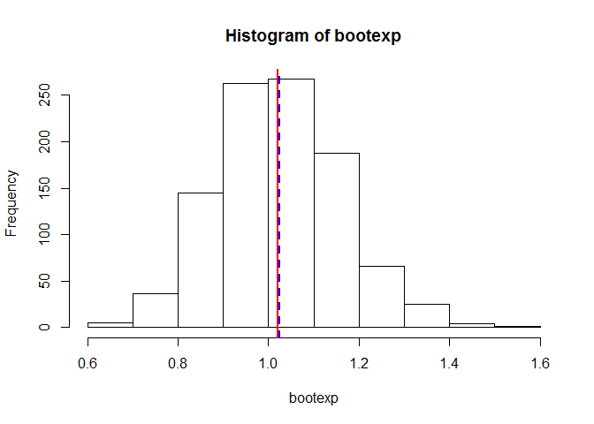
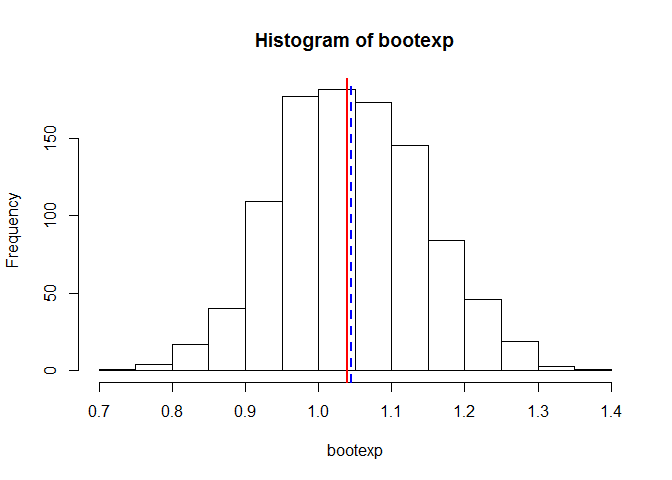

# Proof of Central Limit Theorem through Bootstrapping
Vishi Cline  
October 18, 2016  


#Introduction
This R Markup is meant to prove the central limit theorem using bootstrapping. We will use 
a normal distribution with two different sample sizes and an exponential distribution with
two different sample sizes.

The central limit theorem states that the population of all possible samples of size n from 
a population with mu and variance sd^2 approaches a normal distribution with mean mu:x and sd:x = sd / sqrt(n), when n approaches infinity.  

#Design
We will use bootstrapping to estimate the sampling distribution.  Repeated sampling with replacement from 50 samples mimics what the population might look like.  To take a resample, numbers are randomly selected from the original sample, the mean is recorded, and then that observation is put back into the sample.  This is done 50 times to complete a single resample.  We will do 1000 resamples of our original sample size=50.

#Results
Per the central limit theorem, when we use bootstrapping to generate 1000 replications of both the sample size 50 and 100 - using the normal and exponential distribution - we can see that by taking a large number of repeated samples of the original sample and then calculating the mean of the those samples, we get a mean that is very close to the original sample population mean.  However, due to the bias involved, the population mean is different than the bootstrap mean.  Also, the standard deviation of the original population mean divided by sqrt of the sample size is nearly equal to the bootstrap sd.  The data is normally distributed for the bootstrap mean.

#Code Explanation
In below code, we are using simple random sample using rnorm.  We are running obsersvations of two different sample sizes, namely 50 and 100, with pop mean=22 and pop sd=5.  We start by computing the mean of the sample.  Note that the sample mean is very close to the assumed true population mean of 22.  We then set the number of replications(nsims) to be 1000.

Then we have created a function norm that does the following
  * Initializes the bootnorm vector to hold the replicated bootstrap means.  
  * Generates 1000 bootstrap means from sample x, using observations of size=50, and             replacing the values for every single resample.

Finally, we output the summary of bootnorm.  Note that the bootstrap mean is close to the sample mean (xbar).  Also, per the central limit theorem, the sd of 1000 bootstrap samples of normal distribution of size 50 and the sd of sample mean divided by the square root of the sample size are nearly equal.

##Normal Distribution

```r
set.seed(2534)
size<-50
popMean<-22
popSD<-5
x<-rnorm(size,popMean,popSD)
xbar<-mean(x)
xbar
```

```
## [1] 21.66534
```

```r
nsims<-1000
norm<-function(nsims,x, size){
         bootnorm<-numeric(nsims)
         for(i in 1:nsims){
             temp<-sample(x,size, replace=TRUE)
             bootnorm[i]<-mean(temp)
             }
         bootnorm
 }
bootnorm<-norm(nsims,x,size)
summary(bootnorm)
```

```
##    Min. 1st Qu.  Median    Mean 3rd Qu.    Max. 
##   19.06   21.15   21.65   21.66   22.20   24.09
```

```r
sd(bootnorm)
```

```
## [1] 0.767642
```

```r
sd(x)/sqrt(size)
```

```
## [1] 0.7851249
```

The plot furthermore shows that the distribution of the bootstrap mean distribution is normally distributed.  Note that the original population mean may/may not be similar to the bootstrap mean as there is bias involved.  However, the bootstrap mean and the sample population mean are nearly equal.

```r
hist(bootnorm)
abline(v=xbar,col="red",lwd=2)
abline(v=mean(bootnorm),col="blue",lwd=2,lty=2)
abline(v=popMean,col="cyan",lwd=3,lty=3)
```

<!-- -->

Repeat for size=100

```r
size<-100
bootnorm<-norm(nsims,x,size)
summary(bootnorm)
```

```
##    Min. 1st Qu.  Median    Mean 3rd Qu.    Max. 
##   20.05   21.28   21.65   21.65   22.00   23.73
```

```r
sd(bootnorm)
```

```
## [1] 0.540311
```

```r
sd(x)/sqrt(size)
```

```
## [1] 0.5551671
```

```r
hist(bootnorm)
abline(v=xbar,col="red",lwd=2)
abline(v=mean(bootnorm),col="blue",lwd=2,lty=2)
abline(v=popMean,col="cyan",lwd=3,lty=3)
```

<!-- -->

##Exponential Distribution


```r
size<-50
x<-rexp(n=size)
xbar<-mean(x)
xbar
```

```
## [1] 1.020511
```

```r
nsims<-1000
expon<-function(nsims,x, size){
         bootexp<-numeric(nsims)
         for(i in 1:nsims){
             temp<-sample(x,size, replace=TRUE)
             bootexp[i]<-mean(temp)
             }
         bootexp
 }
bootexp<-expon(nsims,x,size)
summary(bootexp)
```

```
##    Min. 1st Qu.  Median    Mean 3rd Qu.    Max. 
##  0.6407  0.9266  1.0160  1.0240  1.1160  1.5090
```

```r
sd(bootexp)
```

```
## [1] 0.1367543
```

```r
sd(x)/sqrt(size)
```

```
## [1] 0.137965
```

```r
hist(bootexp)
abline(v=xbar,col="red",lwd=2)
abline(v=mean(bootexp),col="blue",lwd=2,lty=2)
```

<!-- -->

Repeat the code with size=100, all other variables assumed to be the same as above.

```r
size<-100
x<-rexp(n=size)
xbar<-mean(x)
xbar
```

```
## [1] 1.039203
```

```r
nsims<-1000
expon<-function(nsims,x, size){
         bootexp<-numeric(nsims)
         for(i in 1:nsims){
             temp<-sample(x,size, replace=TRUE)
             bootexp[i]<-mean(temp)
             }
         bootexp
 }
bootexp<-expon(nsims,x,size)
summary(bootexp)
```

```
##    Min. 1st Qu.  Median    Mean 3rd Qu.    Max. 
##  0.7421  0.9740  1.0420  1.0450  1.1120  1.3720
```

```r
sd(bootexp)
```

```
## [1] 0.09930024
```

```r
sd(x)/sqrt(size)
```

```
## [1] 0.09786068
```

```r
hist(bootexp)
abline(v=xbar,col="red",lwd=2)
abline(v=mean(bootexp),col="blue",lwd=2,lty=2)
```

<!-- -->
